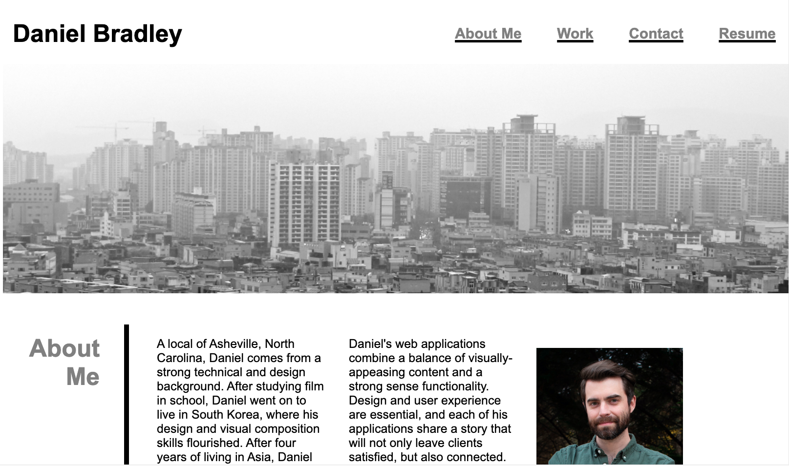
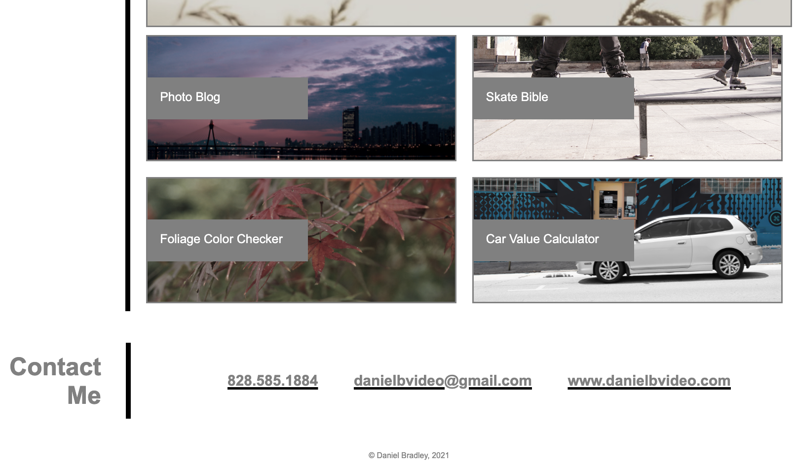

This is a mock-up of a portfolio of web applications that I have created. For this assignment, I have linked an actual external web pages (not newly created, but to demonstrate a clickable item), and have linked the remaining 4 portfolio items to other areas around the page in lieu of an external link. Since there are currently not yet any other applications produced, the images and content are placeholders per the allowed instructions. 

The email address at the bottom of the page is clickable, opening up a new message to the displayed email address using the default email service provider, and personal design site is a clickable redirect as well. Please note that the design site is a personal Squarespace site that I produced several years ago prior to any coding experience. Its use here is to display a clickable redirect link. 

Copyright information is also listed at the bottom. 

 

Github Repository: https://github.com/rollerbladerdan/Portfolio
Github pages deployment: https://rollerbladerdan.github.io/Portfolio/

